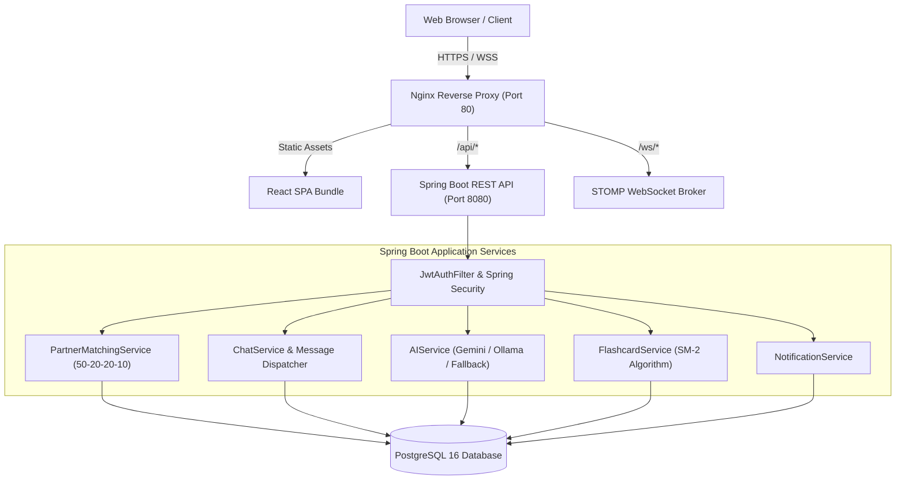

# LinguaLink: Language Exchange & AI-Assisted Learning Platform
**Academic Project Report**

---

## 1. Abstract
**LinguaLink** is a modern, full-stack language exchange platform designed to bridge the gap between autonomous language study and real-world conversational fluency. While traditional language learning tools rely heavily on isolated rote memorization, LinguaLink combines mutual peer learning with cutting-edge artificial intelligence. Users discover compatible language exchange partners through a multi-factor matching algorithm (50% language reciprocity, 20% skill level, 20% shared interests, 10% activity streak), connect in structured 50/50 fair-time practice calls, engage in real-time WebSocket chat, and accelerate vocabulary retention using an AI-powered grammar assistant and SuperMemo-2 (SM-2) spaced repetition flashcard engine. Built on React with Tailwind CSS, Spring Boot 3, and PostgreSQL, LinguaLink delivers a production-grade, secure, and resilient learning ecosystem.

---

## 2. Problem Statement
1. **Lack of Native Speaking Practice:** Language learners often spend years studying grammar rules but lack access to native speakers for authentic verbal and written practice.
2. **Unbalanced Language Exchanges:** Free conversations between learners often suffer from one speaker dominating the conversation in their preferred language, leaving the other partner without equal practice time.
3. **Absence of Real-time Guidance:** In casual peer chats, partners may feel awkward pointing out repetitive grammatical mistakes, reinforcing bad habits.
4. **Poor Vocabulary Retention:** Words learned during casual conversations are quickly forgotten due to the lack of structured spaced-repetition revision.
5. **Security & Privacy Risks:** Many online chat sites lack authenticated connections, exposing users to unsolicited messages and data exposure.

---

## 3. Existing System vs. Proposed System

| Feature / Criterion | Existing Systems (e.g., Duolingo, Tandem, HelloTalk) | Proposed System (LinguaLink) |
|---|---|---|
| **Partner Matching** | Basic search filters without weighted scoring | Multi-factor weighted algorithm (50-20-20-10 scoring) |
| **Call Equity** | Unmonitored, informal voice/video calls | 50/50 split timer with automated language swap alerts |
| **Conversation Starters** | Generic icebreakers | Contextual topic cards with difficulty-tiered vocabulary prompts |
| **Correction Delivery** | Manual corrections by partner or harsh bot alerts | Gentle inline corrections with grammar rule explanations |
| **Vocabulary Mastery** | Static flashcard lists | AI-generated cards from conversation with SM-2 spaced repetition |
| **AI Architecture** | Proprietary walled gardens or client-exposed API keys | Secure Spring Boot backend broker for Gemini & Ollama |
| **Privacy & Security** | Ad-driven tracking and unverified connections | JWT auth, BCrypt hashing, Spring Security, sanitized inputs |

---

## 4. Objectives
* **Develop a Responsive Web Client:** Deliver a clean, Parley-inspired user interface with dark mode, smooth micro-interactions, and accessible controls.
* **Engineer a Robust 4-Tier Backend:** Implement a clean architecture (`Controller` $\rightarrow$ `Service` $\rightarrow$ `Repository` $\rightarrow$ `Database`) using Spring Boot 3.2.
* **Implement Real-time Messaging:** Build low-latency, bidirectional chat using WebSocket STOMP and persistent PostgreSQL message archiving.
* **Integrate Generative AI:** Provide live grammar analysis, dynamic conversation tutoring, and automated vocabulary extraction without exposing API keys to the frontend.
* **Incorporate Cognitive Science:** Implement the SuperMemo-2 (SM-2) algorithm to optimize review intervals and long-term memory retention.

---

## 5. Technology Stack
* **Frontend:**
  * React 18, Vite 5, Tailwind CSS, Vanilla CSS Design System Tokens
  * React Router v6, Axios (with Bearer interceptors), `@stomp/stompjs`, `sockjs-client`
* **Backend:**
  * Java 21/25, Spring Boot 3.2.5, Spring Security 6, Spring Data JPA, Hibernate ORM
  * Spring WebSocket & STOMP Broker, JJWT 0.12.5, Project Lombok
* **Database:**
  * PostgreSQL 16 (Relational DDL, Foreign Keys with cascading actions, Composite Indexes)
* **AI Engine:**
  * Google Gemini API (`gemini-1.5-flash`), Local Ollama API (`llama3`), Smart Rule-based Fallback
* **DevOps & Testing:**
  * Docker, Docker Compose, Nginx, Postman v2.1, JUnit 5, Mockito

---

## 6. System Architecture

---

## 7. Database Design (Entity Relationships)
The PostgreSQL schema encompasses 13 normalized tables:
1. `users`: Stores user credentials (`email`, `password_hash`, `role`, `enabled`, timestamps).
2. `profiles`: One-to-one with `users` (`name`, `bio`, `level`, `avatar_url`, `streak`, `xp`).
3. `languages`: Reference table of languages (`code`, `name`, `flag`).
4. `user_languages`: Many-to-many relationship with proficiency level and type (`NATIVE` or `LEARNING`).
5. `user_interests`: Normalized tags for interest-based matching.
6. `connections`: Tracks follow requests (`sender_id`, `receiver_id`, `status`: `PENDING`/`ACCEPTED`/`REJECTED`).
7. `conversations`: Group and direct dialogue threads (`type`, `title`, timestamps).
8. `conversation_members`: Junction table tracking membership and `last_read_at`.
9. `messages`: Persisted chat entries (`conversation_id`, `sender_id`, `content`, `type`, `sent_at`).
10. `flashcard_decks`: Categorical deck groupings.
11. `flashcards`: Cards equipped with SM-2 spaced repetition fields (`interval_days`, `repetitions`, `ease_factor`, `next_review`, `mastered`).
12. `ai_corrections`: Historical grammar corrections, explanations, and rules.
13. `notifications`: Live event alerts (`type`, `title`, `message`, `is_read`, `link`).

---

## 8. Partner Matching Algorithm
The matching score between User $A$ and User $B$ is calculated over 100 possible points:
$$\text{Total Score} = S_{\text{lang}} + S_{\text{skill}} + S_{\text{interests}} + S_{\text{streak}}$$

* **1. Language Reciprocity ($S_{\text{lang}}$, Max 50 pts):**
  * 50 points if $A$'s native language is in $B$'s learning list **AND** $B$'s native language is in $A$'s learning list.
  * 25 points if there is partial one-way language overlap.
* **2. Skill Compatibility ($S_{\text{skill}}$, Max 20 pts):**
  * 20 points if learners are at complementary or comparable proficiency levels (e.g., Intermediate with Advanced).
* **3. Common Interests ($S_{\text{interests}}$, Max 20 pts):**
  * Calculated via Jaccard-weighted overlap of user interest tags (5 points per shared interest up to 20).
* **4. Activity Streak ($S_{\text{streak}}$, Max 10 pts):**
  * Reward active learners who maintain daily streaks (up to 10 points for a 7+ day streak).

---

## 9. SM-2 Spaced Repetition Algorithm
Flashcards are scheduled using the SuperMemo-2 (SM-2) formula based on user performance ratings:
* **Ratings:**
  * `AGAIN` (Grade 0): Complete blackout $\rightarrow$ repetitions reset to 0, interval = 1 day, $\text{EF} = \max(1.3, \text{EF} - 0.2)$.
  * `HARD` (Grade 2): Difficult recall $\rightarrow$ interval expands moderately ($I \times 1.2$), $\text{EF} = \max(1.3, \text{EF} - 0.15)$.
  * `GOOD` (Grade 4): Successful recall $\rightarrow$ $I_1 = 1$, $I_2 = 6$, $I_n = I_{n-1} \times \text{EF}$.
  * `EASY` (Grade 5): Perfect recall $\rightarrow$ $I_1 = 4$, $I_n = I_{n-1} \times \text{EF} \times 1.3$, $\text{EF} = \min(3.0, \text{EF} + 0.15)$.
* Cards with $\ge 4$ successful repetitions are classified as `Mastered`.

---

## 10. Security Implementation
1. **Password Encryption:** Passwords are never stored in plaintext; salted and hashed using BCrypt (cost factor 10).
2. **Stateless JWT Authentication:** Users receive an HMAC-SHA256 signed token with configurable expiration. Requests are authenticated via `AuthTokenFilter`.
3. **CORS Isolation:** Cross-Origin Resource Sharing is locked down to authorized frontend domains.
4. **SQL Injection Defense:** Strict use of Spring Data JPA and Hibernate parameterized queries with zero concatenated raw SQL strings.
5. **API Key Isolation:** Gemini API keys are held exclusively in server-side environment variables and `.env`, never bundled in client Javascript.

---

## 11. Testing & Validation
* **Unit & Integration Tests:** JUnit 5 and Mockito test suites covering `AuthService`, `FlashcardService` SM-2 calculations, and `PartnerMatchingService`.
* **API Testing:** Complete Postman Collection (`LinguaLink.postman_collection.json`) covering all 8 functional groups.
* **Frontend Verification:** Automated production compilation with Vite (`254 modules transformed`, 0 errors).

---

## 12. Conclusion & Future Enhancements
LinguaLink provides an end-to-end platform for self-directed and peer-to-peer language learning. By uniting structured speaking equity, real-time messaging, AI-driven guidance, and spaced repetition, it transforms passive learners into active speakers. Future extensions will incorporate WebRTC peer-to-peer audio/video streaming, voice pitch analysis, and mobile companion applications using React Native.
